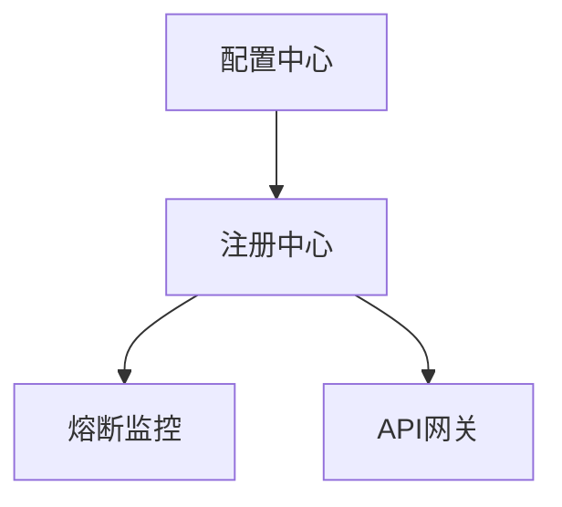

## 前言


## 项目介绍

## 项目架构
 
``` lua
Taroco
├── taroco-assembling -- 项目集合工程
├── taroco-cloud -- spring cloud 微服务相关基础组件
|    ├── cloud-admin -- 服务监控
|    ├── cloud-api-gateway -- 服务网关
|    ├── cloud-circuit-breaker -- 服务容错保护
|    ├── cloud-config -- 分布式配置中心
|    ├── cloud-registry -- 服务注册中心
├── taroco-common -- 项目基础服务组件
├── taroco-user-center -- 用户中心
|    ├── uc-auth -- 用户授权系统
|    ├── uc-command -- 用户命令端
|    ├── uc-common -- 用户公用
|    ├── uc-query -- 用户查询端
```
## 部署说明


根据 Taroco 项目架构中的描述和常见的 Spring Boot/Spring Cloud 项目部署流程，以下是 assembling 部分的部署说明：

---
<!--by ljq -->
### 1.taroco-assembling项目

taroco-assembling 是 Taroco 项目的聚合模块。它主要负责将各个子模块集成到一个整体中，用于统一构建和管理。

#### 1. 环境准备

在部署之前，请确保以下环境已经准备好：

- **JDK 8+**：确保安装了 Java JDK 1.8 或更高版本。
  - [JDK 下载链接](https://www.oracle.com/java/technologies/javase-jdk8-downloads.html)
- **Maven 3.5+**：确保安装了 Maven 构建工具。
  - [Maven 下载链接](https://maven.apache.org/download.cgi)
- **Git**：用于拉取代码仓库。
  - [Git 下载链接](https://git-scm.com/downloads)

#### 2. 拉取代码

1. 使用 Git 克隆项目代码到本地：
   ```bash
   git clone https://github.com/penguin-texas/Taroco.git
   ```
2. 进入项目的根目录：
   ```bash
   cd Taroco
   ```

#### 3. 构建项目

1. 使用 Maven 构建项目，生成所有模块的 .jar 文件：
   ```bash
   mvn clean install -DskipTests
   ```
   > **注意**：-DskipTests 参数会跳过测试用例的执行。如果需要运行测试，请移除该参数。

2. 构建完成后，taroco-assembling 的输出文件将位于 target 文件夹中，例如：
   ```
   taroco-assembling/target/taroco-assembling-0.0.1-SNAPSHOT.jar
   ```

#### 4. 配置文件准备

在运行 taroco-assembling 模块之前，请确保配置文件已正确设置。以下是一个示例 application.yml 配置文件：

```yaml
server:
  port: 8080

spring:
  application:
    name: taroco-assembling

eureka:
  client:
    service-url:
      defaultZone: http://localhost:8761/eureka/ # 注册中心地址
  instance:
    prefer-ip-address: true

logging:
  level:
    root: INFO
```

> **提示**：根据实际情况修改配置文件，例如 Eureka`注册中心地址等。

#### 5. 启动服务

1. 使用以下命令启动 taroco-assembling 模块：
   ```bash
   java -jar taroco-assembling/target/taroco-assembling-0.0.1-SNAPSHOT.jar
   ```

2. 服务启动后，您可以在浏览器中访问 http://localhost:8080 ，以确认服务是否正常运行。

#### 6. 部署到生产环境

如果需要将服务部署到生产环境，请考虑以下事项：

- **操作系统**：推荐使用 Linux 系统（如 CentOS 或 Ubuntu）。
- **进程管理**：使用 systemd、supervisor 或 pm2 等工具管理服务进程。
- **反向代理**：使用 Nginx 配置反向代理以支持 HTTPS 和负载均衡。
- **日志管理**：配置日志文件的存储路径和日志轮转策略。

#### 7. 其他注意事项

- 确保所有依赖的服务（例如 Eureka 注册中心、Config Server 配置中心等）都已正确启动。
- 如需扩展功能，可根据项目需求修改或新增模块。

---
下面是仿照提供的示例为 taroco-user 项目创建的部署说明：


### 2. taroco-user 项目

**组件名称** | **核心功能** | **关键技术**
---|---|---
taroco-user | 用户服务模块，提供用户管理、认证授权、权限控制等功能 | Spring Boot、Spring Cloud、MyBatis-Plus

**部署顺序与依赖关系**  
1. 依赖于 `taroco-root` 父项目提供基础配置
2. 需连接已部署的数据库服务
3. 需注册到服务注册中心（如 Eureka 或 Nacos）
4. 建议配合 API 网关（如 `cloud-api-gateway`）使用


### 2. 详细部署方案

#### **1. 基础环境**
- JDK 8+ 环境
- Maven 3.5+
- Git（用于拉取项目代码）
- 数据库（如 MySQL 5.7+ 或 PostgreSQL）


#### **2. 推荐配置**
- 内存：≥2GB
- 磁盘：≥10GB 可用空间
- 网络：需与注册中心、配置中心、数据库互通


#### **3. 服务部署**

##### **1. 配置数据库**
创建数据库并执行初始化脚本（通常位于项目的 `src/main/resources/sql` 目录）：
```sql
CREATE DATABASE taroco_user CHARACTER SET utf8mb4 COLLATE utf8mb4_unicode_ci;
```


##### **2. 用户服务部署 (taroco-user)**
**配置文件 `application.yml`**：
```yaml
server:
  port: 9001  # 服务端口

spring:
  application:
    name: taroco-user  # 应用名称
  datasource:
    driver-class-name: com.mysql.cj.jdbc.Driver
    url: jdbc:mysql://localhost:3306/taroco_user?useUnicode=true&characterEncoding=utf-8&useSSL=false&serverTimezone=UTC
    username: root
    password: your_password
  cloud:
    nacos:  # 若使用 Nacos 作为注册中心
      discovery:
        server-addr: localhost:8848
    # 若使用 Eureka 作为注册中心
    # eureka:
    #   client:
    #     service-url:
    #       defaultZone: http://localhost:8761/eureka/

mybatis-plus:
  mapper-locations: classpath:mapper/**/*.xml
  type-aliases-package: xyz.weechang.taroco.user.entity
  configuration:
    map-underscore-to-camel-case: true
```

**启动命令**：
```bash
java -jar taroco-user-0.0.1-SNAPSHOT.jar
```


#### **4. 验证部署成功**
1. **注册中心验证**  
   访问注册中心地址（如 Eureka：`http://localhost:8761` 或 Nacos：`http://localhost:8848/nacos`）  
   预期：在服务列表中看到 `taroco-user` 服务已注册。

2. **用户服务验证**  
   调用健康检查接口：
   ```bash
   curl http://localhost:9001/actuator/health
   ```
   预期返回：
   ```json
   {"status":"UP"}
   ```

3. **API 网关验证（若已集成）**  
   通过网关访问用户服务：
   ```bash
   curl http://localhost:8080/user/actuator/health
   ```
   预期返回：
   ```json
   {"status":"UP"}
   ```


### 3. 常见问题

1. **数据库连接失败**  
   - 检查数据库地址、用户名、密码是否正确
   - 确保数据库服务已启动且可访问

2. **服务未注册到注册中心**  
   - 检查注册中心地址配置是否正确
   - 确认注册中心服务已正常运行

3. **依赖冲突**  
   - 使用 `mvn dependency:tree` 查看依赖树，排除冲突依赖
   - 确保父项目 `taroco-root` 版本兼容


### 4. 扩展配置

**开启监控端点**：
```yaml
management:
  endpoints:
    web:
      exposure:
        include: "*"  # 暴露所有监控端点
  endpoint:
    health:
      show-details: always  # 显示健康检查详情
```

**配置日志**：
```yaml
logging:
  level:
    root: INFO
    xyz.weechang: DEBUG  # 项目包路径，调整日志级别
  file:
    name: logs/taroco-user.log  # 日志文件位置
```


通过以上步骤，可完成 `taroco-user` 服务的独立部署或集成到已有微服务架构中。


<!--by lqk -->
### 3.taroco-cloud项目

组件名称|核心功能|关键技术
--|:--:|--:
cloud-api-gateway|统一API入口，提供路由转发，权限控制，请求过滤等能力  |Zuul/Gateway
cloud-circuit-breaber|熔断监控仪表盘，实时可视化健康状态|Hystrix Dashboard
cloud-config-server|集中化管理服务配置，支持多环境隔离部署|Spring Cloud Config Server
cloud-registry-server|服务注册与发现中心，管理微服务实例元数据|Eureka Server

### 部署顺序与依赖关系

### 详细部署方案
1.基础环境
+ [JDK 8+环境](https://www.oracle.com/cn/java/technologies/downloads/) 

+ [Maven 3.5+](https://maven.apache.org/download.cgi)

+ [Git(用于配置仓库)](https://git-scm.com/downloads)

2.推荐配置
+ 内存：≥4GB

+ 磁盘：≥20GB可用空间

+ 网络：各组件间需互通

### 配置中心部署

#### 1.配置中心部署(cloud-config-server)
配置文件application.yml :
```
server:
  port: 8888
spring:
  cloud:
    config:
      server:
        git:
          uri: https://github.com/your-org/config-repo
          search-paths: '{application}'
```
##### 启动命令:
`java -jar cloud-config-server-0.0.1-SNAPSHOT.jar`

#### 2.注册中心部署(cloud-registry-server)
配置文件application.yml :
```
server:
  port: 8761
eureka:
  instance:
    hostname: localhost
  client:
    register-with-eureka: false
    fetch-registry: false
```
##### 启动命令:
`java -jar cloud-registry-server-0.0.1-SNAPSHOT.jar`

#### 3.熔断监控部署(cloud-circuit-breaker)
配置文件application.yml :
```
server:
  port: 7979
management:
  endpoints:
    web:
      exposure:
        include: hystrix.stream
```
##### 启动命令:
`java -jar cloud-circuit-breaker-0.0.1-SNAPSHOT.jar`

#### 4.API网关部署(cloud-api-gateway)
配置文件application.yml :
```
server:
  port: 8080
zuul:
  routes:
    user-service:
      path: /user/**
      serviceId: user-service
```
##### 启动命令:
`java -jar cloud-api-gateway-0.0.1-SNAPSHOT.jar`

#### 验证部署成功
+ 注册中心
   + 访问:http://localhost:8761 
   + 预期:显示Eureka控制台,无注册服务
+ 配置中心
   + 访问:http://localhost:8888/application/default 
   + 预期:返回JSON格式的配置信息
+ 熔断监控
   + 访问:http://localhost:7979/hystrix
   + 预期:显示Hystrix Dashboard页面
+ API网关
   + 访问:http://localhost:8080/your-service
   + 预期:返回{"status":"UP"}
<!-- by lqk -->
### 技术选型

#### 后端技术:
技术 | 名称 | 官网
----|------|----
Spring Boot | 容器  | [http://projects.spring.io/spring-boot/](http://projects.spring.io/spring-boot/)
Spring Cloud | 容器  | [http://projects.spring.io/spring-cloud/](http://projects.spring.io/spring-cloud/)
Axon | 容器  | [http://www.axonframework.org/](http://www.axonframework.org/)
Rabbit MQ | 容器  | [http://www.rabbitmq.com/](http://www.rabbitmq.com/)
Spring Data | 容器  | [http://projects.spring.io/spring-data/](http://projects.spring.io/spring-data/)
Swagger2 | 接口测试框架  | [http://swagger.io/](http://swagger.io/)
Jenkins | 持续集成工具  | [https://jenkins.io/index.html](https://jenkins.io/index.html)
Maven | 项目构建管理  | [http://maven.apache.org/](http://maven.apache.org/)

#### 前端技术:
技术 | 名称 | 官网
----|------|----
VUE | 函式库  | [https://cn.vuejs.org/](https://cn.vuejs.org/)
vue-router 2 | vue路由  | [https://router.vuejs.org/zh-cn/](https://router.vuejs.org/zh-cn/)
iview | VUE组件  | [https://www.iviewui.com](https://www.iviewui.com)

#### 开发工具:
- MongoDB: 数据库
- Tomcat: 应用服务器
- Git: 版本管理
- Nginx: 反向代理服务器
- IntelliJ IDEA: 开发IDE

#### 开发环境：
- JDK8+
- MongoDB

## 许可证

[MIT](LICENSE "MIT")
