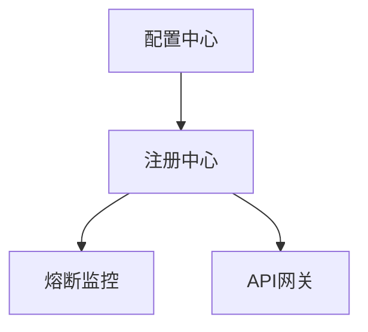

## 前言


## 项目介绍

## 项目架构
 
``` lua
Taroco
├── taroco-assembling -- 项目集合工程
├── taroco-cloud -- spring cloud 微服务相关基础组件
|    ├── cloud-admin -- 服务监控
|    ├── cloud-api-gateway -- 服务网关
|    ├── cloud-circuit-breaker -- 服务容错保护
|    ├── cloud-config -- 分布式配置中心
|    ├── cloud-registry -- 服务注册中心
├── taroco-common -- 项目基础服务组件
├── taroco-user-center -- 用户中心
|    ├── uc-auth -- 用户授权系统
|    ├── uc-command -- 用户命令端
|    ├── uc-common -- 用户公用
|    ├── uc-query -- 用户查询端
```
## 部署说明

<!--by lqk -->
### 1.taroco-cloud项目

组件名称|核心功能|关键技术
--|:--:|--:
cloud-api-gateway|统一API入口，提供路由转发，权限控制，请求过滤等能力  |Zuul/Gateway
cloud-circuit-breaber|熔断监控仪表盘，实时可视化健康状态|Hystrix Dashboard
cloud-config-server|集中化管理服务配置，支持多环境隔离部署|Spring Cloud Config Server
cloud-registry-server|服务注册与发现中心，管理微服务实例元数据|Eureka Server

### 部署顺序与依赖关系

### 详细部署方案
1.基础环境
+ [JDK 8+环境](https://www.oracle.com/cn/java/technologies/downloads/) 

+ [Maven 3.5+](https://maven.apache.org/download.cgi)

+ [Git(用于配置仓库)](https://git-scm.com/downloads)

2.推荐配置
+ 内存：≥4GB

+ 磁盘：≥20GB可用空间

+ 网络：各组件间需互通

### 配置中心部署

#### 1.配置中心部署(cloud-config-server)
配置文件application.yml :
```
server:
  port: 8888
spring:
  cloud:
    config:
      server:
        git:
          uri: https://github.com/your-org/config-repo
          search-paths: '{application}'
```
##### 启动命令:
`java -jar cloud-config-server-0.0.1-SNAPSHOT.jar`

#### 2.注册中心部署(cloud-registry-server)
配置文件application.yml :
```
server:
  port: 8761
eureka:
  instance:
    hostname: localhost
  client:
    register-with-eureka: false
    fetch-registry: false
```
##### 启动命令:
`java -jar cloud-registry-server-0.0.1-SNAPSHOT.jar`

#### 3.熔断监控部署(cloud-circuit-breaker)
配置文件application.yml :
```
server:
  port: 7979
management:
  endpoints:
    web:
      exposure:
        include: hystrix.stream
```
##### 启动命令:
`java -jar cloud-circuit-breaker-0.0.1-SNAPSHOT.jar`

#### 4.API网关部署(cloud-api-gateway)
配置文件application.yml :
```
server:
  port: 8080
zuul:
  routes:
    user-service:
      path: /user/**
      serviceId: user-service
```
##### 启动命令:
`java -jar cloud-api-gateway-0.0.1-SNAPSHOT.jar`

#### 验证部署成功
+ 注册中心
  访问:http://localhost:8761 
  -[X]预期:显示Eureka控制台,无注册服务
+ 配置中心
  访问:http://localhost:8888/application/default 
  -[X]预期:返回JSON格式的配置信息
+ 熔断监控
  访问:http://localhost:7979/hystrix
  -[X]预期:显示Hystrix Dashboard页面
+ API网关
  访问:http://localhost:8080/your-service
  -[X]预期:返回{"status":"UP"}
<!-- by lqk -->
### 技术选型

#### 后端技术:
技术 | 名称 | 官网
----|------|----
Spring Boot | 容器  | [http://projects.spring.io/spring-boot/](http://projects.spring.io/spring-boot/)
Spring Cloud | 容器  | [http://projects.spring.io/spring-cloud/](http://projects.spring.io/spring-cloud/)
Axon | 容器  | [http://www.axonframework.org/](http://www.axonframework.org/)
Rabbit MQ | 容器  | [http://www.rabbitmq.com/](http://www.rabbitmq.com/)
Spring Data | 容器  | [http://projects.spring.io/spring-data/](http://projects.spring.io/spring-data/)
Swagger2 | 接口测试框架  | [http://swagger.io/](http://swagger.io/)
Jenkins | 持续集成工具  | [https://jenkins.io/index.html](https://jenkins.io/index.html)
Maven | 项目构建管理  | [http://maven.apache.org/](http://maven.apache.org/)

#### 前端技术:
技术 | 名称 | 官网
----|------|----
VUE | 函式库  | [https://cn.vuejs.org/](https://cn.vuejs.org/)
vue-router 2 | vue路由  | [https://router.vuejs.org/zh-cn/](https://router.vuejs.org/zh-cn/)
iview | VUE组件  | [https://www.iviewui.com](https://www.iviewui.com)

#### 开发工具:
- MongoDB: 数据库
- Tomcat: 应用服务器
- Git: 版本管理
- Nginx: 反向代理服务器
- IntelliJ IDEA: 开发IDE

#### 开发环境：
- JDK8+
- MongoDB

## 许可证

[MIT](LICENSE "MIT")
